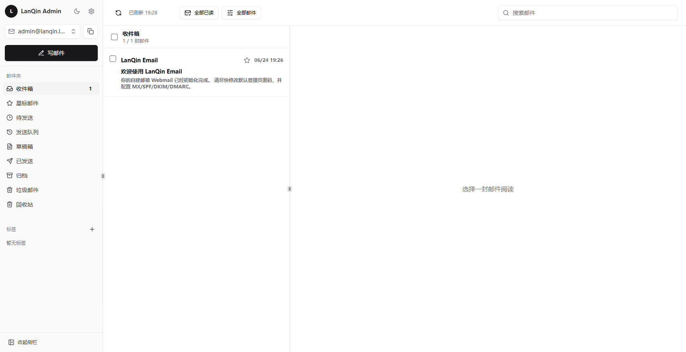
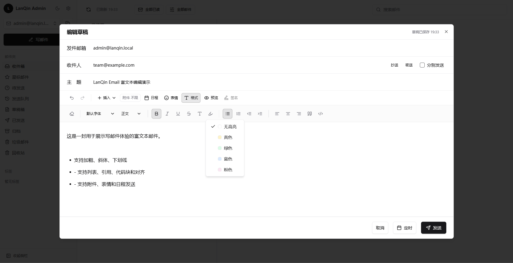
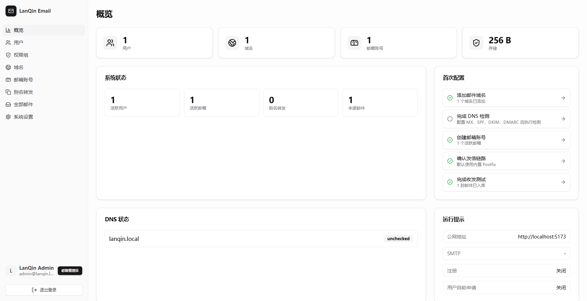
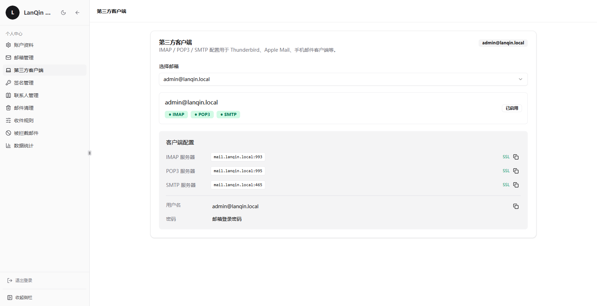

# LanQin Email

[](./README.md)
[](./README.zh-CN.md)


LanQin Email is a self-hosted full-stack webmail solution. The frontend is built with React + TypeScript + shadcn/ui, the backend uses Go + SQLite, and deployment can run as a single all-in-one container with API, Web, Nginx, Postfix, Dovecot, and Rspamd integrated.

Community: [Telegram group](https://t.me/+EhII7MSyi3QwNDQ5)

## Features

- **Webmail client**: multiple mailbox switching, folders, reading and composing messages, drafts, scheduled sending, attachments, search, labels, stars, move/delete, read/unread status.
- **Mailbox enhancements**: contacts, signatures, inbox rules, sender blacklist, mail statistics, archive read messages, empty Trash/Spam.
- **Multi-domain / multi-mailbox**: domain management, DKIM key generation, DNS record display and checks, mailbox accounts, alias forwarding, catch-all toggle.
- **Accounts and permissions**: login/registration, session management, TOTP two-factor authentication, Cloudflare Turnstile, user self-service mailbox requests, permission groups/RBAC.
- **Admin panel**: overview checklist, user/permission group/domain/mailbox/alias/all-message management, system settings, mail templates, SMTP testing.
- **Mail service stack**: Postfix delivery, Dovecot IMAP/POP3, Rspamd anti-spam and DKIM signing, Maildir-to-SQLite sync.
- **Deployment friendly**: default all-in-one single container, plus a multi-container stack for debugging Postfix/Dovecot/Rspamd.

## UI Preview

| Webmail reading and list | Compose · rich-text toolbar |
| --- | --- |
|  |  |
| Switch mailboxes, folders, search, labels, stars, and message reading panel. | Rich-text toolbar supports fonts, headings, bold, italic, underline, colors, highlights, lists, alignment, quotes, code blocks, attachments, emoji, and scheduled sending. |
| Admin panel · system overview | Third-party client configuration |
|  |  |
| Manage users, permission groups, domains, mailboxes, aliases, system settings, and send audits. | View IMAP / POP3 / SMTP servers, ports, security modes, and account information in one place. |

## Repository Structure

```text
.
├── apps/api              # Go API, SQLite schema, mail sync, and business logic
├── apps/web              # React/Vite Webmail and admin panel
├── deploy                # Docker Compose, image build, Postfix/Dovecot/Rspamd config
└── .github/workflows     # Docker image release workflows
```

## Requirements

### Development

- Go 1.25+
- Node.js 20+
- pnpm 10.28.2 (can be enabled through corepack)

### Deployment

- Docker Engine
- Docker Compose v2
- A resolvable mail domain, plus available ports such as 25 / 465 / 587 / 993 / 995

> Public email sending and receiving also requires correct MX, SPF, DKIM, and DMARC records, and you should confirm that your cloud provider does not block SMTP ports.

## Quick Start

### Local Development

Backend:

```bash
cd apps/api
go mod download
go test ./...
go run ./cmd/server
```

Frontend (new terminal):

```bash
cd apps/web
corepack enable
corepack prepare pnpm@10.28.2 --activate
pnpm install
pnpm run dev
```

Open:

- Web: `http://localhost:5173`
- API: `http://localhost:8080`

The default admin email is `admin@lanqin.local`. For development, explicitly set `LANQIN_ADMIN_PASSWORD`; if it is not set, the backend generates a random password on first startup and prints it to the logs.

### Docker Deployment (single container)

A server only needs the Compose files and configuration under `deploy/`; building from source is not required:

```bash
cd deploy
cp .env.example .env
# Edit .env: domain, public URL, admin email, admin password, etc.
docker compose pull
docker compose up -d
```

Common commands:

```bash
# View logs
docker compose logs -f lanqin-email

# Pull the latest image and restart
docker compose pull
docker compose up -d

# Stop services
docker compose down
```

To build the image locally from the full source repository:

```bash
cd deploy
cp .env.example .env
docker compose -f docker-compose.yml -f docker-compose.build.yml up -d --build
```

See [`deploy/README.md`](./deploy/README.md) for more deployment details.

## First Deployment Checklist

1. Edit `deploy/.env`: at minimum, change `LANQIN_PUBLIC_HOSTNAME`, `LANQIN_PUBLIC_BASE_URL`, `LANQIN_ADMIN_EMAIL`, and `LANQIN_ADMIN_PASSWORD`.
2. In production, mount real TLS certificates and set `LANQIN_TLS_CERT_FILE` / `LANQIN_TLS_KEY_FILE`.
3. Log in to the admin panel and add your mail domain.
4. Copy and configure MX, SPF, DKIM, and DMARC records from domain management, then run the DNS check.
5. Create mailbox accounts, alias forwarding, or permission groups; enable registration, 2FA, Turnstile, and self-service mailbox requests as needed.
6. Use the admin SMTP test and Webmail send/receive tests to confirm the full path works.

## Key Environment Variables

See [`deploy/.env.example`](./deploy/.env.example) for the full configuration. Common variables:

| Variable | Description | Default / Example |
|------|------|-----------|
| `LANQIN_IMAGE` | All-in-one image | `ghcr.io/lanqin996/lanqin-email:latest` |
| `LANQIN_PUBLIC_HOSTNAME` | Mail server hostname; affects Postfix/DNS display/links | `mail.example.com` |
| `LANQIN_PUBLIC_BASE_URL` | Public Webmail URL | `https://mail.example.com` |
| `LANQIN_ADMIN_EMAIL` | Initial admin email | `admin@example.com` |
| `LANQIN_ADMIN_PASSWORD` | Initial admin password; must be changed in production | `ChangeMe123!` |
| `LANQIN_DB_PATH` | SQLite database path | `/data/lanqin.db` |
| `LANQIN_ALLOW_INSECURE_HTTP` | Allow non-HTTPS cookies; useful for local debugging | `false` |
| `LANQIN_OPEN_REGISTRATION` | Enable public registration | `false` |
| `LANQIN_TWO_FACTOR_ENABLED` | Global 2FA feature toggle | `false` |
| `LANQIN_TURNSTILE_ENABLED` | Enable Turnstile | `false` |
| `LANQIN_SMTP_HOST` / `LANQIN_SMTP_PORT` | Webmail outbound SMTP | `127.0.0.1` / `25` |
| `LANQIN_MAILDIR_ROOT` | Maildir root directory | `/var/mail/vhosts` |
| `LANQIN_CATCH_ALL_ENABLED` | Whether unregistered recipient addresses go into all messages | `false` |
| `LANQIN_USER_MAILBOX_APPLY_ENABLED` | Allow users to request mailboxes by themselves | `false` |
| `LANQIN_EXTERNAL_IMAP_ENABLED` | Enable external IMAP access; also configurable in Admin > System Settings > External IMAP | `false` |
| `LANQIN_EXTERNAL_IMAP_SECRET_KEY` | Encryption key for external IMAP passwords; required before enabling access; also configurable in admin | Random long string |
| `LANQIN_EXTERNAL_IMAP_SYNC_SECONDS` | Sync interval for external IMAP local-storage mode; also configurable in admin | `300` |
| `LANQIN_EXTERNAL_IMAP_ALLOW_PRIVATE_HOSTS` | Allow external IMAP to connect to private/localhost hosts; also configurable in admin | `false` |
| `LANQIN_EXTERNAL_IMAP_GMAIL_CLIENT_ID` / `LANQIN_EXTERNAL_IMAP_GMAIL_CLIENT_SECRET` | Gmail external IMAP OAuth2; callback is `/api/external-imap-oauth/gmail/callback` | Empty |
| `LANQIN_EXTERNAL_IMAP_OUTLOOK_CLIENT_ID` / `LANQIN_EXTERNAL_IMAP_OUTLOOK_CLIENT_SECRET` | Microsoft 365 / Outlook external IMAP OAuth2; callback is `/api/external-imap-oauth/outlook/callback` | Empty |

## Architecture

```text
┌────────────────────────────────────────────────────────────┐
│                 lanqin-email single container              │
│                                                            │
│  ┌─────────┐       ┌────────────┐       ┌──────────────┐   │
│  │  Nginx  │ ───▶  │ Go API     │ ───▶  │ SQLite /data │   │
│  │ Web     │       │ Webmail API│       └──────┬───────┘   │
│  │ static  │       └─────┬──────┘              │           │
│  └─────────┘             │ Maildir sync        │ maps      │
│  ┌─────────┐       ┌─────▼──────┐       ┌──────▼───────┐   │
│  │ Rspamd  │ ◀───▶ │ Postfix    │ ───▶  │ Dovecot/LMTP │   │
│  │ DKIM/AS │       │ SMTP/MTA   │       │ IMAP/POP3    │   │
│  └─────────┘       └────────────┘       └──────────────┘   │
└────────────────────────────────────────────────────────────┘
```

Mail flow:

1. **Receiving**: Postfix receives mail → Rspamd scores/marks it → Dovecot writes to Maildir → API worker syncs it into SQLite → Webmail displays it.
2. **Sending**: Webmail calls the API → API builds MIME → SMTP submits to Postfix or an external SMTP server → mail is delivered to the destination.
3. **Local delivery**: In development, internal mailboxes can send directly into the recipient Inbox; if `LANQIN_SMTP_HOST` is not configured, external recipients are not actually delivered.
4. **Third-party clients**: Connect with SMTP 465/587, IMAP 993, or POP3 995; in production, configure certificates that match `LANQIN_PUBLIC_HOSTNAME`.
5. **External mailbox access**: Users can add external IMAP accounts in personal mailbox management. Local-storage mode syncs mail into the database; remote-direct mode reads from the remote server each time and does not write into local mail tables.

## Open API

External integrations should use the versioned `/api/open/v1` endpoints with scoped API Tokens. See the [API guide](docs/API.md) and the machine-readable [OpenAPI 3.1 contract](docs/openapi.json). Sending supports idempotency keys; final delivery events can be ingested through a signed endpoint and all status changes can be pushed through the reliable signed webhook outbox.

## Development and Verification

```bash
# API tests
cd apps/api
go test ./...

# Web checks and build
cd apps/web
pnpm run check

# Single-container source build verification
cd deploy
docker compose -f docker-compose.yml -f docker-compose.build.yml up -d --build
```

## Production Notes

- In production, always change the default admin password and protect `.env`, the SQLite database, Maildir, and DKIM private keys.
- The Web UI can sit behind host Nginx / aaPanel / an edge gateway, but SMTP/IMAP/POP3 certificates must be mounted separately for Postfix/Dovecot inside the container.
- Cloud providers often block port 25 by default; if public email does not send or receive, first check ports, security groups, firewalls, and reverse DNS.
- SQLite is suitable for single-node deployments; before multi-node deployment, migrate the database and adjust Postfix/Dovecot query configuration accordingly.

## SMTP Submission

- Third-party client SMTP submission on `465/587` is handled by the LanQin API process.
- Before enabling SMTP submission, configure `LANQIN_TLS_CERT_FILE` / `LANQIN_TLS_KEY_FILE`; the API will not expose 465/587 externally with a localhost self-signed certificate.
- Postfix only keeps port `25` for public inbound mail and internal/external relay.
- Webmail/API and third-party client sends are first written into Sent, then enter the send queue.
- The send queue is relayed by a LanQin API background worker to `LANQIN_SMTP_HOST:LANQIN_SMTP_PORT`; failures are audited and retried with backoff.
- v1 supports sending from the user's own mailbox. For send-as, use an enabled alias forwarding source that points to the user's mailbox, or configure `send_as_grants` in the database.
- If the client later writes its own Sent copy through IMAP APPEND, Maildir sync deduplicates by `Message-ID` within the Sent folder.

## License

[MIT](./LICENSE)

## Star History

<a href="https://www.star-history.com/?repos=LanQin996%2FLanQin-Email&type=date&legend=top-left">
 <picture>
   <source media="(prefers-color-scheme: dark)" srcset="https://api.star-history.com/chart?repos=LanQin996/LanQin-Email&type=date&theme=dark&legend=top-left" />
   <source media="(prefers-color-scheme: light)" srcset="https://api.star-history.com/chart?repos=LanQin996/LanQin-Email&type=date&legend=top-left" />
   
 </picture>
</a>

Friends: [LINUX DO](https://linux.do/) — a new ideal community
