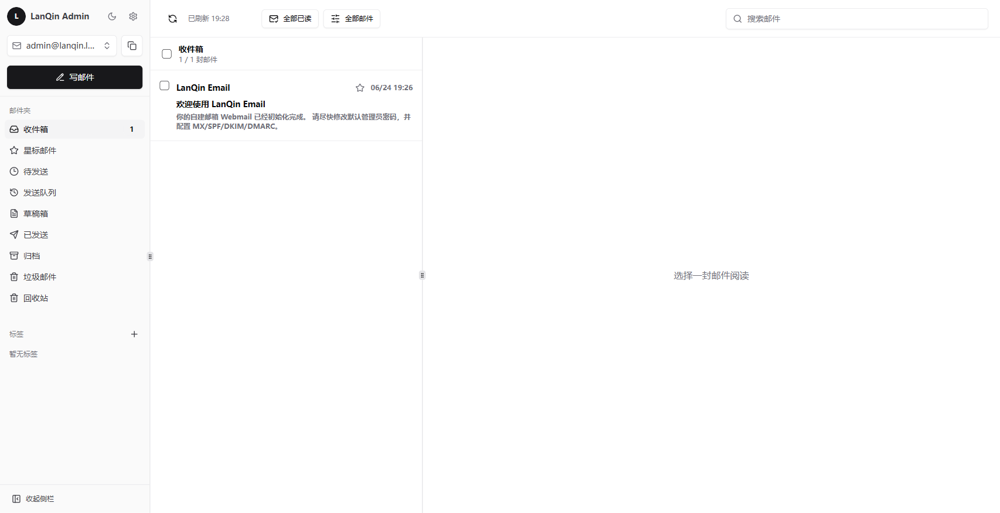
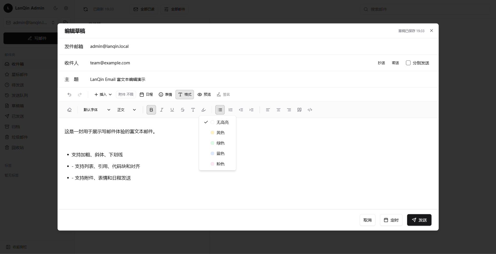
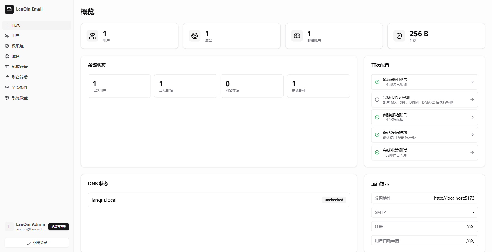
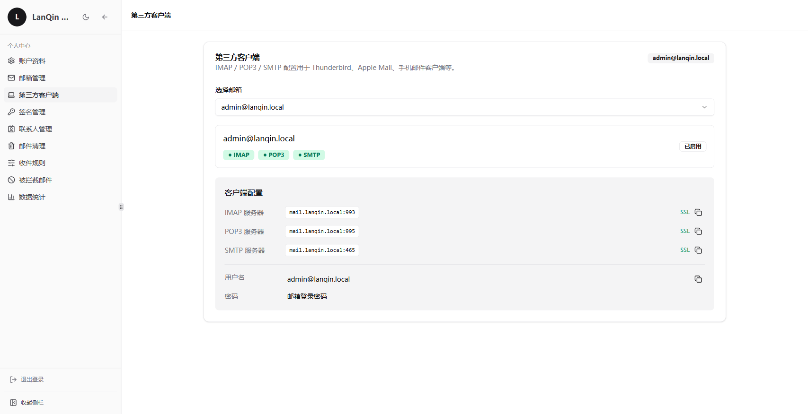

# LanQin Email

[](./README.md)
[](./README.zh-CN.md)


LanQin Email is a self-hosted full-stack webmail solution. The frontend is built with React + TypeScript + shadcn/ui, the backend uses Go + SQLite, and deployment can run as a single all-in-one container with API, Web, Nginx, Postfix, Dovecot, and Rspamd integrated.

Community: [Telegram group](https://t.me/+EhII7MSyi3QwNDQ5)

## Features

- **Webmail client**: multiple mailbox switching, folders, reading and composing messages, drafts, scheduled sending, attachments, search, labels, stars, move/delete, read/unread status.
- **Mailbox enhancements**: contacts, signatures, inbox rules (including automatic forwarding after delivery), sender blacklist, mail statistics, archive read messages, empty Trash/Spam.
- **Multi-domain / multi-mailbox**: domain management, DKIM key generation, DNS record display and checks, mailbox accounts, address aliases (delivery redirection, not inbox auto-forwarding), catch-all toggle.
- **Accounts and permissions**: email/password login, Linux.do OAuth2 SSO, session management (changing the password revokes other sessions; an administrator password reset revokes every session and disables that user's API tokens), TOTP two-factor authentication (disabling it requires the current password), Cloudflare Turnstile, user self-service mailbox requests, permission groups/RBAC with per-group quotas for attachment size, send rate, and mailbox count.
- **Admin panel**: overview checklist, user/permission group/domain/mailbox/alias/all-message management, system settings, mail templates, SMTP testing.
- **Mail service stack**: Postfix delivery, Dovecot IMAP/POP3, Rspamd anti-spam and DKIM signing, Maildir-to-SQLite sync.
- **Deployment friendly**: default all-in-one single container, plus a multi-container stack for debugging Postfix/Dovecot/Rspamd.

## UI Preview

| Webmail reading and list | Compose · rich-text toolbar |
| --- | --- |
|  |  |
| Switch mailboxes, folders, search, labels, stars, and message reading panel. | Rich-text toolbar supports fonts, headings, bold, italic, underline, colors, highlights, lists, alignment, quotes, code blocks, attachments, emoji, and scheduled sending. |
| Admin panel · system overview | Third-party client configuration |
|  |  |
| Manage users, permission groups, domains, mailboxes, aliases, system settings, and send audits. | View IMAP / POP3 / SMTP servers, ports, security modes, and account information in one place. |

## Repository Structure

```text
.
├── apps/api              # Go API, SQLite schema, mail sync, and business logic
├── apps/web              # React/Vite Webmail and admin panel
├── deploy                # Docker Compose, image build, Postfix/Dovecot/Rspamd config
└── .github/workflows     # Docker image release workflows
```

## Requirements

### Development

- Go 1.25+
- Node.js 20+
- pnpm 10.28.2 (can be enabled through corepack)

### Deployment

- Docker Engine
- Docker Compose v2
- A resolvable mail domain, plus available ports such as 25 / 465 / 587 / 993 / 995

> Public email sending and receiving also requires correct MX, domain SPF, HELO-host SPF, DKIM, and DMARC records, and you should confirm that your cloud provider does not block SMTP ports.

## Quick Start

### Local Development

Backend:

```bash
cd apps/api
go mod download
go test ./...
go run ./cmd/server
```

Frontend (new terminal):

```bash
cd apps/web
corepack enable
corepack prepare pnpm@10.28.2 --activate
pnpm install
pnpm run dev
```

Open:

- Web: `http://localhost:5173`
- API: `http://localhost:8080`

The default admin email is `admin@lanqin.local`. For development, explicitly set `LANQIN_ADMIN_PASSWORD`; if it is not set, the backend generates a random password on first startup and prints it to the logs.

### Docker Deployment (single container)

A server only needs the Compose files and configuration under `deploy/`; building from source is not required:

```bash
cd deploy
cp .env.example .env
# Edit .env: domain, public URL, admin email, admin password, etc.
docker compose pull
docker compose up -d
```

Common commands:

```bash
# View logs
docker compose logs -f lanqin-email

# Pull the latest image and restart
docker compose pull
docker compose up -d

# Stop services
docker compose down
```

To build the image locally from the full source repository:

```bash
cd deploy
cp .env.example .env
docker compose -f docker-compose.yml -f docker-compose.build.yml up -d --build
```

See [`deploy/README.md`](./deploy/README.md) for more deployment details.

## First Deployment Checklist

1. Edit `deploy/.env`: at minimum, change `LANQIN_PUBLIC_HOSTNAME`, `LANQIN_PUBLIC_BASE_URL`, `LANQIN_ADMIN_EMAIL`, and `LANQIN_ADMIN_PASSWORD`.
2. In production, mount real TLS certificates and set `LANQIN_TLS_CERT_FILE` / `LANQIN_TLS_KEY_FILE`.
3. Log in to the admin panel and add your mail domain.
4. Copy and configure MX, SPF, DKIM, and DMARC records from domain management, then run the DNS check.
5. Create mailbox accounts, address aliases, or permission groups; enable registration, 2FA, Turnstile, and self-service mailbox requests as needed. Address aliases redirect delivery; configure post-delivery automatic forwarding under Profile > Inbox Rules after verifying the destination address by email code. The inbox copy is retained, while historical, auto-generated, and previously auto-forwarded messages are not forwarded again.
6. Use the admin SMTP test and Webmail send/receive tests to confirm the full path works.

## Linux.do SSO

Linux.do SSO is disabled by default and is configured in **Admin > System Settings > Security**:

1. Visit [Connect.Linux.Do](https://connect.linux.do/) and choose **My Application Access > Apply for New Access**.
2. Set the callback URL to `https://your-lanqin-host/api/auth/linuxdo/callback`. It must exactly match the read-only callback URL shown in LanQin.
3. Copy the issued Client ID and Client Secret into LanQin, then enable Linux.do login. The Client Secret is never returned to the browser; leaving the field blank on later saves preserves its current value.
4. Optionally enable Linux.do registration independently of normal open registration. New users must choose an active local mail domain and prefix, then set a local password. Turnstile still applies when enabled.

Existing users must sign in with their local account before linking Linux.do under **Profile > Account**. LanQin binds only the immutable Linux.do `id`; it never matches accounts by username or email prefix. Local passwords remain usable, and users with TOTP enabled must still complete TOTP during SSO login and link/unlink operations. Disabling SSO hides the login entry but does not delete existing bindings.

Production SSO requires a valid HTTPS `LANQIN_PUBLIC_BASE_URL`. LanQin uses the fixed official OAuth endpoints and requests only the `user` scope.

## Invitation Registration

Invitation registration is configured in **Admin > System Settings > Security**. When public registration is disabled but invitation registration is enabled, users must enter a valid invitation code. Administrators can create a custom code or let LanQin generate one, set its maximum number of uses, view and copy the full code later, monitor remaining uses, and delete it. Successful registration and use-count updates are committed in one database transaction. Linux.do registration remains controlled by its separate switch.

Each code may also be bound to a permission group: anyone registering with it joins that group automatically, which is how you hand out different capabilities without editing each new account. Leaving the selection empty grants only the regular user group, matching the previous behaviour. The super administrator group can never be bound. Because a code that grants a permission group is an authorization tool rather than a settings tweak, **managing invitation codes now requires an actual super administrator** — the `admin.settings.update` permission is no longer sufficient.

If the bound group is deleted before the code is used, registration fails with a clear error instead of silently falling back to the default group, and the code is not consumed.

## Linux.do Registration Groups

When Linux.do registration is enabled, you may select a permission group that every Linux.do sign-up joins. Unlike invitation codes, a group that has been deleted is skipped with a warning rather than blocking sign-up, because this setting is static and easy to leave stale.

## Permission Group Quotas

Every permission group carries a quota set, edited in **Admin > Permission Groups**: attachment size, SMTP recipients per day and messages per minute, IMAP and POP3 commands per minute, the number of mailboxes a user may create, and how many mailboxes they may create per day. **`0` means unlimited** for every one of these fields. A user who belongs to several groups receives the most generous value of each field.

The daily SMTP allowance is charged **per recipient**, so one message addressed to 10 people costs 10; the per-minute allowance still counts **messages**, since its job is to throttle request rate. A single message carries at most 100 recipients across To/CC/BCC after deduplication and at most 20 attachments, and the attachment size limit applies to each attachment individually.

The mailbox quota counts **every mailbox ever created** for the user, including mailboxes that were later deleted, so deleting a mailbox does not hand the allowance back. This is what prevents a user from cycling create and delete to exceed the limit. Self-service requests under **Profile > Mailboxes** are refused once the limit is reached; mailboxes created by an administrator or through the Open API are allowed past it but still count towards the total. The default allowance for regular users is 3 mailboxes.

The per-day limit applies on top of the total, so both must pass. It uses a rolling 24 hour window rather than a calendar day, which stops one mailbox at 23:59 and another at 00:01 from defeating a limit of one per day. **Unused allowance does not accumulate**: skipping a day never grants two the next day. The default is 1 per day, so an upgraded deployment starts enforcing it immediately; set it to `0` to restore the previous unlimited behaviour.

## Key Environment Variables

See [`deploy/.env.example`](./deploy/.env.example) for the full configuration. Common variables:

| Variable | Description | Default / Example |
|------|------|-----------|
| `LANQIN_IMAGE` | All-in-one image | `ghcr.io/lanqin996/lanqin-email:latest` |
| `LANQIN_PUBLIC_HOSTNAME` | Mail server hostname; affects Postfix/DNS display/links | `mail.example.com` |
| `LANQIN_PUBLIC_BASE_URL` | Public Webmail URL | `https://mail.example.com` |
| `LANQIN_ADMIN_EMAIL` | Initial admin email | `admin@example.com` |
| `LANQIN_ADMIN_PASSWORD` | Initial admin password; must be changed in production | `ChangeMe123!` |
| `LANQIN_DB_DRIVER` | API database driver: `sqlite`, `mysql`, or `postgres` | `sqlite` |
| `LANQIN_DATABASE_URL` | MySQL DSN or PostgreSQL URL; required for external databases | Empty |
| `LANQIN_DB_PATH` | SQLite database path | `/data/lanqin.db` |
| `LANQIN_ALLOW_INSECURE_HTTP` | Allow non-HTTPS cookies; useful for local debugging. Also gates the localhost CORS allowance | `false` |
| `LANQIN_TRUSTED_PROXY_COUNT` | Number of trusted reverse proxies in front of the API. `0` ignores forwarding headers and uses the TCP peer address; the bundled Compose setup puts Nginx in front, so it sets `1` | `0` |
| `LANQIN_OPEN_REGISTRATION` | Enable public registration | `false` |
| `LANQIN_TWO_FACTOR_ENABLED` | Global 2FA feature toggle | `false` |
| `LANQIN_TURNSTILE_ENABLED` | Enable Turnstile | `false` |
| `LANQIN_SMTP_HOST` / `LANQIN_SMTP_PORT` | Webmail outbound SMTP | `127.0.0.1` / `25` |
| `LANQIN_MAILDIR_ROOT` | Maildir root directory | `/var/mail/vhosts` |
| `LANQIN_MAILDIR_SCAN_SECONDS` | Maildir incoming-message scan interval in seconds | `5` |
| `LANQIN_CATCH_ALL_ENABLED` | Whether unregistered recipient addresses go into all messages | `false` |
| `LANQIN_USER_MAILBOX_APPLY_ENABLED` | Allow users to request mailboxes by themselves | `false` |
| `LANQIN_EXTERNAL_IMAP_ENABLED` | Enable external IMAP access; also configurable in Admin > System Settings > External IMAP | `false` |
| `LANQIN_EXTERNAL_IMAP_SECRET_KEY` | Encryption key for external IMAP passwords; required before enabling access; also configurable in admin | Random long string |
| `LANQIN_EXTERNAL_IMAP_SYNC_SECONDS` | Sync interval for external IMAP local-storage mode; also configurable in admin | `300` |
| `LANQIN_EXTERNAL_IMAP_ALLOW_PRIVATE_HOSTS` | Allow external IMAP to connect to private/localhost hosts; also configurable in admin | `false` |
| `LANQIN_EXTERNAL_IMAP_GMAIL_CLIENT_ID` / `LANQIN_EXTERNAL_IMAP_GMAIL_CLIENT_SECRET` | Gmail external IMAP OAuth2; callback is `/api/external-imap-oauth/gmail/callback` | Empty |
| `LANQIN_EXTERNAL_IMAP_OUTLOOK_CLIENT_ID` / `LANQIN_EXTERNAL_IMAP_OUTLOOK_CLIENT_SECRET` | Microsoft 365 / Outlook external IMAP OAuth2; callback is `/api/external-imap-oauth/outlook/callback` | Empty |
| `LANQIN_NOTIFICATION_SECRET_KEY` | Master key used to encrypt each user's Telegram Bot Token; required for Telegram rule actions. Also encrypts TOTP two-factor seeds | Random long string |
| `LANQIN_AUTH_POLICY_SECRET` | Shared secret for the endpoint Dovecot queries for IMAP/POP3 rate limits. Only needed when API port 8080 is exposed directly | Empty |

This key is generated by the deployment operator; Telegram does not issue it. For example, use the cryptographically secure PowerShell command `$b = New-Object byte[] 32; [Security.Cryptography.RandomNumberGenerator]::Fill($b); [Convert]::ToBase64String($b)` or `openssl rand -base64 32`, place it in the deployment `.env`, and restart the API. It is an encryption root key and is intentionally not stored through the admin UI. Back it up securely: changing or losing it makes existing Bot Tokens undecryptable and invalidates encrypted TOTP seeds. Seeds written before the key was configured stay in plaintext and keep working; an administrator can rebind an affected user through **Admin > Users > Reset two-factor authentication**, which also ends that user's sessions and disables their API tokens.

## Architecture

The all-in-one deployment supports SQLite, MySQL 8.4, and PostgreSQL 16. SQLite remains the default. Add one database override to the base Compose file when selecting MySQL or PostgreSQL. Existing SQLite data is not migrated automatically.

```bash
# SQLite (default)
docker compose --env-file deploy/.env -f deploy/docker-compose.yml up -d

# MySQL 8.4
docker compose --env-file deploy/.env -f deploy/docker-compose.yml -f deploy/docker-compose.mysql.yml up -d

# PostgreSQL 16
docker compose --env-file deploy/.env -f deploy/docker-compose.yml -f deploy/docker-compose.postgres.yml up -d
```

Each variant keeps Nginx, the API, Postfix, Dovecot, and Rspamd in the existing `lanqin-email` container and adds only one database container. See `deploy/.env.example` for the required passwords.

```text
┌────────────────────────────────────────────────────────────┐
│                 lanqin-email single container              │
│                                                            │
│  ┌─────────┐       ┌────────────┐       ┌──────────────┐   │
│  │  Nginx  │ ───▶  │ Go API     │ ───▶  │ SQLite /data │   │
│  │ Web     │       │ Webmail API│       └──────┬───────┘   │
│  │ static  │       └─────┬──────┘              │           │
│  └─────────┘             │ Maildir sync        │ maps      │
│  ┌─────────┐       ┌─────▼──────┐       ┌──────▼───────┐   │
│  │ Rspamd  │ ◀───▶ │ Postfix    │ ───▶  │ Dovecot/LMTP │   │
│  │ DKIM/AS │       │ SMTP/MTA   │       │ IMAP/POP3    │   │
│  └─────────┘       └────────────┘       └──────────────┘   │
└────────────────────────────────────────────────────────────┘
```

Mail flow:

1. **Receiving**: Postfix receives mail → Rspamd scores/marks it → Dovecot writes to Maildir → API worker syncs it into SQLite → Webmail displays it.
2. **Sending**: Webmail calls the API → API builds MIME → SMTP submits to Postfix or an external SMTP server → mail is delivered to the destination.
3. **Local delivery**: In development, internal mailboxes can send directly into the recipient Inbox; if `LANQIN_SMTP_HOST` is not configured, external recipients are not actually delivered.
4. **Third-party clients**: Connect with SMTP 465/587, IMAP 993, or POP3 995; in production, configure certificates that match `LANQIN_PUBLIC_HOSTNAME`.
5. **External mailbox access**: Users can add external IMAP accounts in personal mailbox management. Local-storage mode syncs mail into the database; remote-direct mode reads from the remote server each time and does not write into local mail tables.

## Open API

External integrations should use the versioned `/api/open/v1` endpoints with scoped API Tokens. See the [API guide](docs/API.md) and the machine-readable [OpenAPI 3.1 contract](docs/openapi.json). Sending supports idempotency keys; final delivery events can be ingested through a signed endpoint and all status changes can be pushed through the reliable signed webhook outbox.

## Development and Verification

```bash
# API tests
cd apps/api
go test ./...

# Web checks and build
cd apps/web
pnpm run check

# Single-container source build verification
cd deploy
docker compose -f docker-compose.yml -f docker-compose.build.yml up -d --build
```

## Production Notes

- In production, always change the default admin password and protect `.env`, the SQLite database, Maildir, and DKIM private keys.
- The Web UI can sit behind host Nginx / aaPanel / an edge gateway, but SMTP/IMAP/POP3 certificates must be mounted separately for Postfix/Dovecot inside the container.
- Cloud providers often block port 25 by default; if public email does not send or receive, first check ports, security groups, firewalls, and reverse DNS.
- SQLite is suitable for single-node deployments; before multi-node deployment, migrate the database and adjust Postfix/Dovecot query configuration accordingly.
- `/auth-policy`, which Dovecot queries for IMAP/POP3 rate limits, is registered outside `/api` and does not check sessions; it relies on not being proxied by Nginx and only being reachable inside the container. If you expose the API's `8080` publicly, set `LANQIN_AUTH_POLICY_SECRET` and append `?key=<value>` to `LANQIN_AUTH_POLICY_URL`.

## SMTP Submission

- Third-party client SMTP submission on `465/587` is handled by the LanQin API process.
- Before enabling SMTP submission, configure `LANQIN_TLS_CERT_FILE` / `LANQIN_TLS_KEY_FILE`; the API will not expose 465/587 externally with a localhost self-signed certificate.
- Postfix only keeps port `25` for public inbound mail and internal/external relay.
- Webmail/API and third-party client sends are first written into Sent, then enter the send queue.
- The send queue is relayed by a LanQin API background worker to `LANQIN_SMTP_HOST:LANQIN_SMTP_PORT`; failures are audited and retried with backoff.
- v1 supports sending from the user's own mailbox. For send-as, use an enabled alias forwarding source that points to the user's mailbox, or configure `send_as_grants` in the database.
- If the client later writes its own Sent copy through IMAP APPEND, Maildir sync deduplicates by `Message-ID` within the Sent folder.

## License

[MIT](./LICENSE)

## Star History

<a href="https://www.star-history.com/?repos=LanQin996%2FLanQin-Email&type=date&legend=top-left">
 <picture>
   <source media="(prefers-color-scheme: dark)" srcset="https://api.star-history.com/chart?repos=LanQin996/LanQin-Email&type=date&theme=dark&legend=top-left" />
   <source media="(prefers-color-scheme: light)" srcset="https://api.star-history.com/chart?repos=LanQin996/LanQin-Email&type=date&legend=top-left" />
   
 </picture>
</a>

Friends: [LINUX DO](https://linux.do/)  —  a new ideal community
